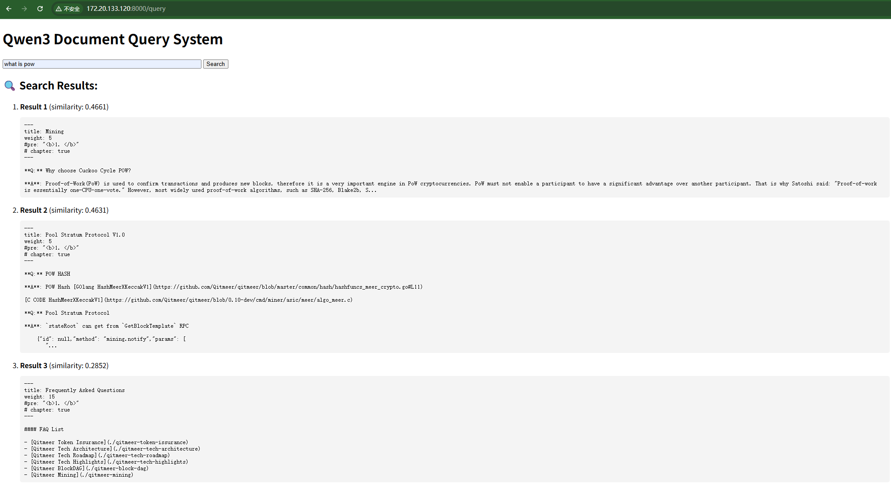

# Qwen3 Document Query System

A document query system built with Qwen3 embeddings and Qdrant vector database. This system allows users to search through documents using semantic similarity.

## Features

- Document embedding using Qwen3 model
- Vector storage with Qdrant
- Real-time semantic search
- Automatic vector store updates every 24 hours
- Web interface for easy querying

## Prerequisites

- Python 3.8+
- Qdrant server running locally or remotely
- Qwen3 model access

## Installation

1. Clone the repository:
```bash
git clone [your-repository-url]
cd qng_docs_embedding
```

2. Install dependencies:
```bash
pip install -r requirements.txt
```

## Usage

1. Start the application:
```bash
python main.py
```

2. Open your browser and navigate to `http://localhost:8000`

3. Enter your query in the search box and click "Search"


## Project Structure

- `app.py`: Main FastAPI application
- `vector_store.py`: Vector store operations using Qdrant
- `templates/`: HTML templates for the web interface
- `requirements.txt`: Project dependencies

## API Endpoints

- `GET /`: Main web interface
- `POST /query`: Submit a search query

## License

[Your License]

## Contributing

[Your Contribution Guidelines]